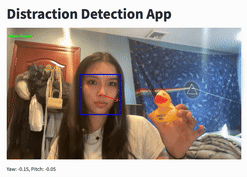

## Table of Contents
* [About](#about-)
* [Getting Started](#getting-started-)
* [Contact Us](#contact-us-)

## About 💡
**_Focus Point_ is a real-time distraction detection application that monitors and analyzes gaze direction and head movement using computer vision and machine learning. Our application allows users to understand their attention span and find ways to regain their focus back.**  


### Problem Statement 🎯
In today’s digital age, technology, smartphones, and social media platforms like TikTok have negatively impacted our ability to concentrate on a single task for an extended period. These platforms display endless streams of short-form content, making it especially difficult for younger generations to maintain focused.  
  
Our project aims to help users understand and analyze their patterns of focus and distraction. By becoming aware of these habits, individuals can take proactive steps to improve their focus and regain control over their time and productivity.

### Key Features
**Eye Gaze Detection**  
We implemented a gaze detection model to recognize when someones gaze is no longer at the screen. For each frame, it returns us the pitch and yaw and we use these numbers to set thresholds.

**Head Pose Estimation**  
Alongside the gaze detection, we also added a head pose estimation and once again set our thresholds to recognize when someone is not facing the screen. This model combined with the gaze model allows us to determine whether someone is distracted or focused.

**Timer**  
Users can start and end the program. We added a timer function that displays the total time that the user was distracted/focused. This allows users to gain a better understanding of their distracted to focused ratio.  
  

## Getting Started ✅
```bash
# Clone our repository
git clone https://github.com/sophiayau/DistractionDetection.git

# Navigate into the repo
cd DistractionDetection

# Install dependencies
pip install -r requirements.txt

# Run the application
python app.py
```


## Contact Us 👩‍💻👨‍💻
**Sophia Yau**  
  
[](https://github.com/sophiayau)
[](https://www.linkedin.com/in/sophiayau/)
[](mailto:sophiayau888@gmail.com)


**Ye Htut Maung (Mike)**  
  
[](https://github.com/ye-htut-maung)
[](https://www.linkedin.com/in/ye-htut-maung/)
[](mailto:yehtutmaung21@gmail.com)

  
**Afnan Ebrahim**  

[](https://github.com/Afnan214)
[](https://www.linkedin.com/in/afnan214/)
[](mailto:afnan.ebrahim214@gmail.com)


